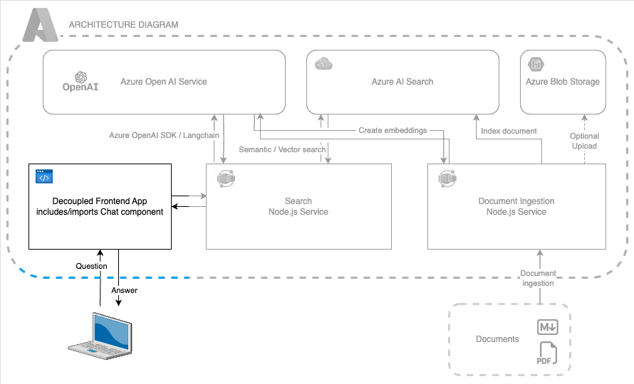

# Azure OpenAI Chat Frontend

A classic chat user interface that can be used to send messages to an OpenAI API and receive responses. 

This application is frontend application implemented with [Lit](https://lit.dev/), consisting of multiple LitElements that can be used to interact with the Azure OpenAI API.


[](https://github.com/codespaces/new?hide_repo_select=true&ref=main&repo=782482632&machine=standardLinux32gb&devcontainer_path=.devcontainer%2Fdevcontainer.json&location=WestUs2)
[](https://vscode.dev/redirect?url=vscode://ms-vscode-remote.remote-containers/cloneInVolume?url=https://github.com/Azure-Samples/azure-openai-chat-frontend)

## Features

When opening in Codespaces or Remote Containers, you will have all the dependencies preinstalled. Once the container is ready, run

```sh
npm start
```

The frontend will be running in forwarded port 8000. 

> [!IMPORTANT]
> You will need to follow instructions in [Getting Started](#getting-started), to deploy a backend and connect it to the frontend app.

[Features](#features) • [Gettting Started](#getting-started) • [Guidance](#guidance) • [Resources](#resources) 

## Features

This repo features a classic Chat-GPT-like user interface, including additional capabilities to debug responses, restyle, revisit history and reset the chat.

### Technical Stack

The following technologies are part of the frontend application:

- [Lit](https://lit.dev) and LitElement
- [Web Components](https://developer.mozilla.org/en-US/docs/Web/Web_Components)
- [Vite](https://vitejs.dev/guide/) and [Rollup](https://rollupjs.org/introduction/) for local development, bundling and serving
- [TypeScript](https://www.typescriptlang.org/)
- [ESLint](https://eslint.org/) and [Prettier](https://prettier.io/) for code linting and formatting

### Architecture Diagram

The code in this repository represents the frontend application or colored area in the following diagram. It assumes a backend middleware and service deployments are in place. For a full reference, [visit this repo](https://github.com/Azure-Samples/azure-search-openai-javascript/tree/main)



## Demo Video

The following video shows the user interface. Styles are fully configurable!

https://github.com/Azure-Samples/azure-openai-chat-frontend/assets/4014025/a2933baa-bb8d-42b6-ad8e-a8cf052ddbd0


## Getting started


### Running the application

This application is optimized to be opened in a container. The frontend application is configured using a global configuration file. You can enable or disable the default prompts, and configure the default prompt texts, the API endpoint and other settings.

All texts and labels are configurable to match your use case. To customize the texts, please edit the [global config](./src/config/global-config.js) file.

### Local installation

To run the application locally, you must install [Node.js LTS](https://nodejs.org) and make sure you can run `npm` commands from your terminal.

Then you can proceed by following these steps:

Initialize as an [Azure Developer CLI](https://learn.microsoft.com/azure/developer/azure-developer-cli/overview), running

```bash
azd init -t azure-openai-chat-frontend
```

- To install all npm dependencies, please run `npm install`. This is a npm workspace, so all dependencies will be installed in the root folder.
- To start the local development server, open a new terminal and run `npm run start`. This will start the local development server on port 8000.
- To build the application, open a new terminal and run `npm run build`. This will generate a production build in the `dist` folder.

> [IMPORTANT]
> For the application to be functional, you will need to connect it to a locally running or remotely [deployed backend service](#deploying-the-app-to-azure-static-web-apps), and make sure that the data attribute `data-api-url` is pointing to the correct endpoint.

## Connecting to a deployed backend

The Search API service implements the [HTTP protocol for AI chat apps](https://github.com/Azure-Samples/ai-chat-app-protocol). It can be used with any backend service that implements the same protocol.

| Recommended backend repos | Development environment | 
| -- | -- | 
|Property rental domain with [Node.js](https://github.com/Azure-Samples/azure-search-openai-javascript)|[](https://codespaces.new/Azure-Samples/azure-search-openai-javascript)<br>Example question: `What is the refund policy`|
|Employee benefits with [Python](https://github.com/Azure-Samples/azure-search-openai-demo)|[](https://codespaces.new/Azure-Samples/azure-search-openai-demo)<br>Example question: `What is included in my Northwind Health Plus plan that is not in standard?`|
|Employee benefits with [.NET and C#](https://github.com/Azure-Samples/azure-search-openai-demo-csharp)|[](https://codespaces.new/Azure-Samples/azure-search-openai-demo-csharp)<br>Example question: `What is included in my Northwind Health Plus plan that is not in standard?`|

To connect to a backend, follow these steps:

1. Deploy the backend services as explained in their respective repository readme files, for example following these [steps to deploy the backend](https://github.com/Azure-Samples/azure-search-openai-javascript#deploying-from-scratch).
2. Once the backend service is fully deployed, get the backend URL with `azd env get-values | grep BACKEND_URI`.
3. Deploy the frontend application to Azure as [explained here](#deploying-the-app-to-azure-static-web-apps) or start it locally or in Codespaces.
4. Set the backend URL in this repo, running `azd env set BACKEND_URI <your_backend_url>` that you got in step 2.
5. Depending on whether you want to use the deployed frontend app or the local frontend app:

- If you want to use the deployed frontend app, run `azd up` to redeploy.
- If you want to use the local frontend app on your machine or in Codespaces, run:

  ```sh
  # Export the environment variable.
  # The syntax may be different depending on your shell or if you're using Windows.
  export BACKEND_URI=<your_backend_url>

  # Start the app
  npm start
  ```

> [NOTE]
> You may need to enable CORS in your backend service, by running `azd env set ALLOWED_ORIGIN <your_frontend_url>` then deploy again with `azd up`. 

Get the frontend URL, following this table:

| Environment | URL                                                     |
| ----------- | ------------------------------------------------------- |
| Local       | http://localhost:8000                                   |
| Production  | `azd env get-values \| grep FRONTEND_URI`               |
| Codespace   | `https://<your_codespace_base_url>-8000.app.github.dev` |

## Using this module as a library

If you want to use the module as a library as it is used in [the JavaScript sample](https://github.com/Azure-Samples/azure-search-openai-javascript), set the environment variable `IS_LIB` to true, running `azd env set IS_LIB true`.

## Guidance

### Deploying 

- if you initialized as an [Azure Developer CLI](https://learn.microsoft.com/azure/developer/azure-developer-cli/overview) template as explained above, you can run:

`azd up` and follow the instructions in the terminal.

- if you cloned or forked, you can also use the [Azure Static Web Apps CLI](https://learn.microsoft.com/azure/static-web-apps/static-web-apps-cli-deploy), by running `swa init && swa deploy`

### Security considerations

If you're deploying this sample to [Azure Static Web Apps](https://learn.microsoft.com/azure/static-web-apps/overview), using the [Azure Developer CLI template](./infra/), please consider enabling user authentication, following [this guide](https://learn.microsoft.com/en-us/azure/static-web-apps/authentication-authorization). 

Authenticating requests to the backend service, will need to be implemented in the backend service solution.

## Resources

- [AI Chat Protocol](https://github.com/microsoft/ai-chat-protocol)
